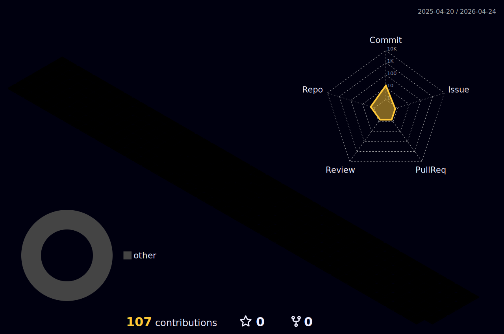

# 👋 ¡Hola! Soy Miguel Tabares  

💻 Analista y Desarrollador de Software **Full Stack orientado a la Web**.  
Me especializo en la construcción de aplicaciones completas, desde el frontend atractivo y funcional hasta el backend robusto y escalable.  

---

## ⚡ Tecnologías principales  

  <!-- Lenguajes -->
  

---

## 📌 Proyectos destacados  
🔹 [Proyecto 1](#) – Breve descripción de lo que hace.  
🔹 [Proyecto 2](#) – Breve descripción de lo que hace.  
🔹 [Proyecto 3](#) – Breve descripción de lo que hace.  

---

## 📊 Estadísticas de GitHub  

  
  

---

## 🐉 Contribuciones en 3D  

  

---

## 📫 Contacto  
📧 Email: [tuemail@example.com](mailto:tuemail@example.com)  
💼 LinkedIn: [Tu LinkedIn](https://linkedin.com/in/tuusuario)  
🌐 Portafolio: [Tu página web](https://tuweb.com)  
