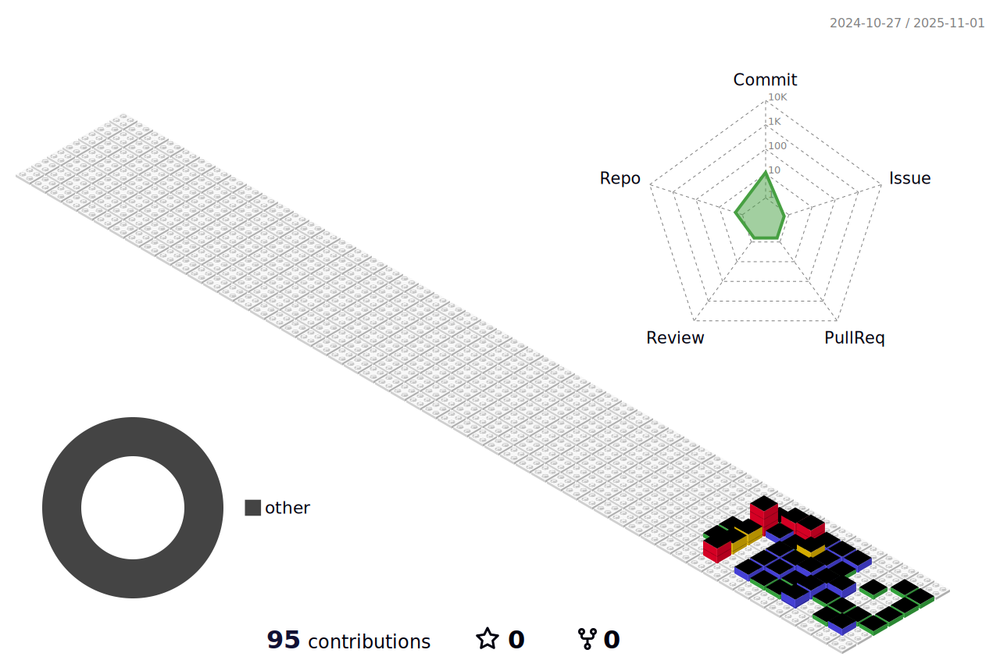

<h1 align="center"> 
  Hello there, I'm Miguel 
  
</h1>

  

💻 Software Analyst & **Full Stack Web Developer**  
I specialize in building complete web applications — from modern, engaging frontends to robust and scalable backends.  

---

## ⚡ Main Technologies  

 

---

## 📫 Contact  
📧 Email: [youremail@example.com](mailto:youremail@example.com)  
💼 LinkedIn: [Miguel Tabares](https://co.linkedin.com/in/miguel-tabares-334988356)  
🌐 Portfolio: [Your Website](https://yourwebsite.com)  

---

## 📌 Featured Projects  

🚧 *Coming soon... I’m currently working on building and publishing my main projects here. Stay tuned!* 🚀  

---

## 📊 GitHub Stats  

  
  

---

## 🐉 3D Contributions  

  

---
