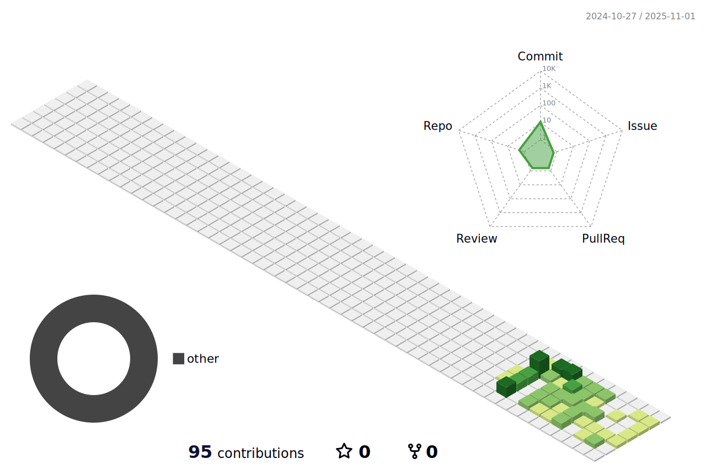

<h1 align="center"> 
  Hello there, I'm Miguel
  
</h1>

  

💻 Software Analyst & **Junior Full Stack Web Developer**  
I specialize in building complete web applications — from modern, engaging frontends to robust and scalable backends.  

---

# ⚡ Tech Stack

<!-- Frontend -->
### Frontend

<!-- Backend -->
### Backend

<!-- Frameworks -->
### Frameworks

<!-- Database -->
### Database

<!-- DevOps & Deployment -->
### DevOps & Deployment

<!-- Version Control & Collaboration -->
### Version Control & Collaboration

<!-- Design & UX/UI -->
### Design & UX/UI

---

## 📫 Contact

  <!-- Email -->
  

  <!-- LinkedIn -->
  

  <!-- Phone -->
  

---

## 📌 Featured Projects  

🚧 *Coming soon... I’m currently working on building and publishing my main projects here. Stay tuned!* 🚀  

---

## 💼 Experience

- **Full Stack Project - Management System - Parcerottis [SENA]**  
  Developed a web system as the final deliverable for the Software Analysis and Development program.  
  - Full stack implementation using **React, Node.js, Express, and MySQL**.  
  - Modules for authentication, user management, orders, and production workflows.  
  - Deployment and version control using **GitHub**.  
  - Team collaboration following agile methodologies (Scrum).

- **Project Documentation / Front-End  - Gestión de Pagos [Diana Pulgarín]**  
  Created technical and functional documentation for a software project.  
  - Requirement research and analysis.  
  - Writing use cases, UML diagrams, and architecture proposals.
  - Created front-end views for subsequent migration and implementation in the benchmark.
  - A benchmark with a better cost/benefit ratio was identified, so the project did not have backend development and therefore did not move into production.

---

## 🐉 3D Contributions  

  

---
